# Readme

### 1.use SpringMVC

### 2.use JPA 

WorkerRepository

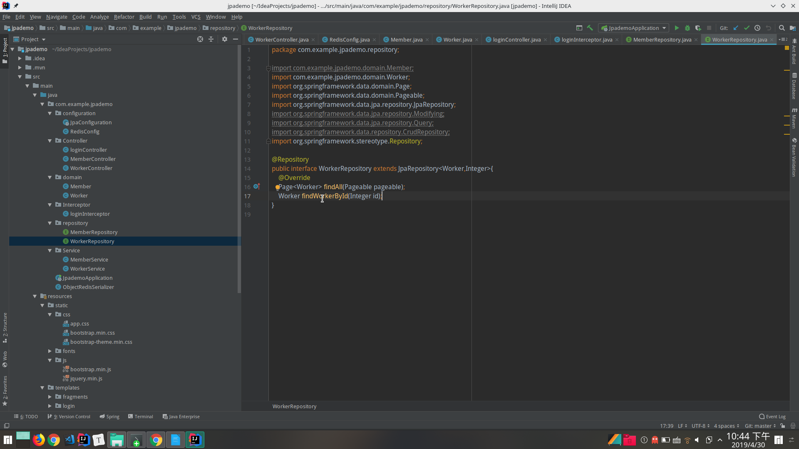

### 3.use DBMS 

use mysql

### 4.use query to multiple tables

Worker

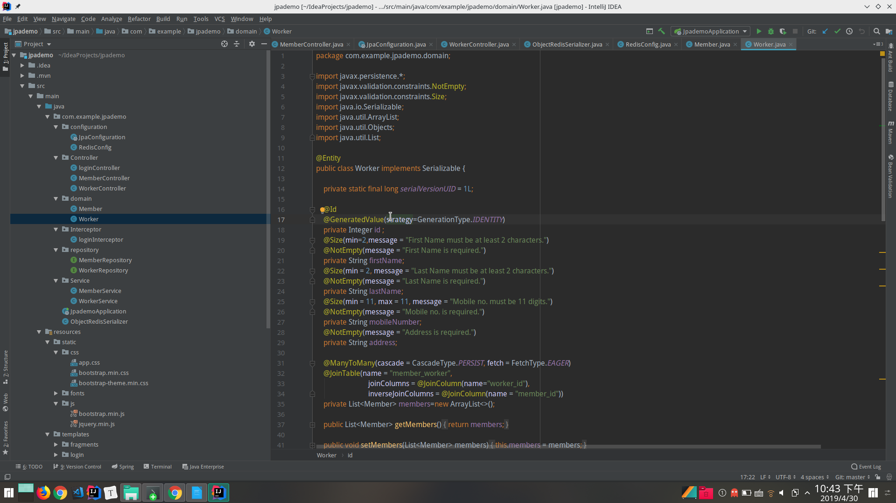

Member

   

### 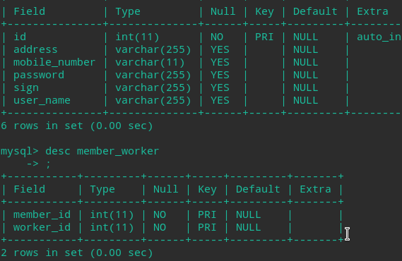

### 5.use pagination

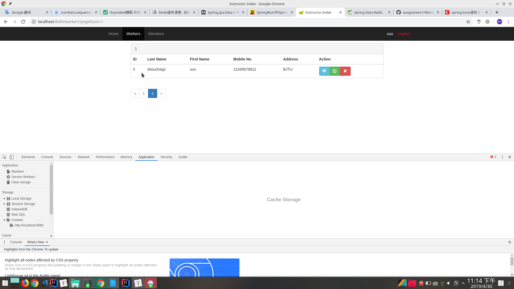

### 6.use multi datasources

transactional

### 7.use Web Caching

Redis

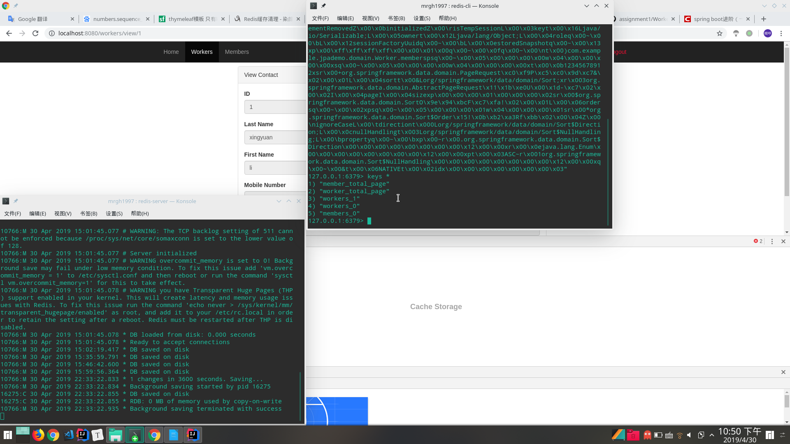

#### 项目截图

LoginControler

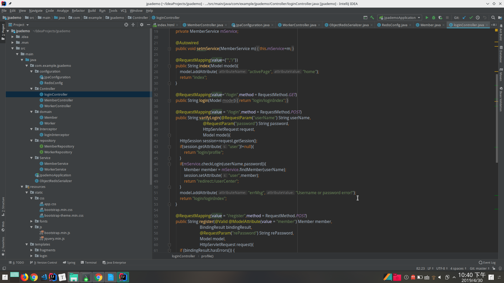

Member

MemberControler

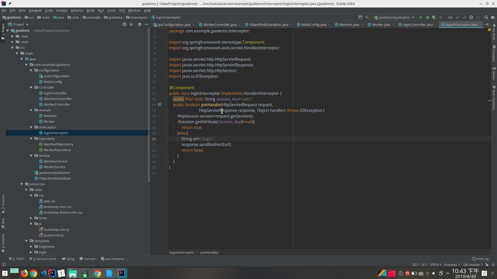

DuobiaoView

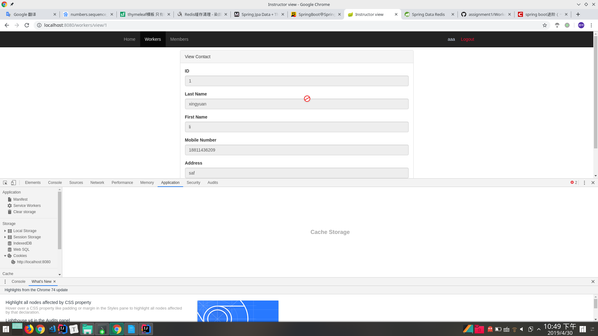

MemberView

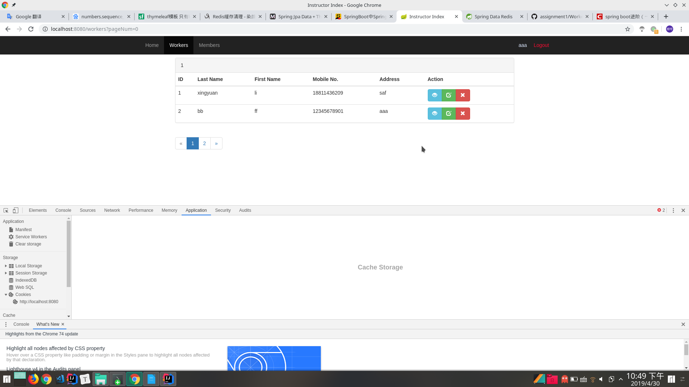

Redis

Repository

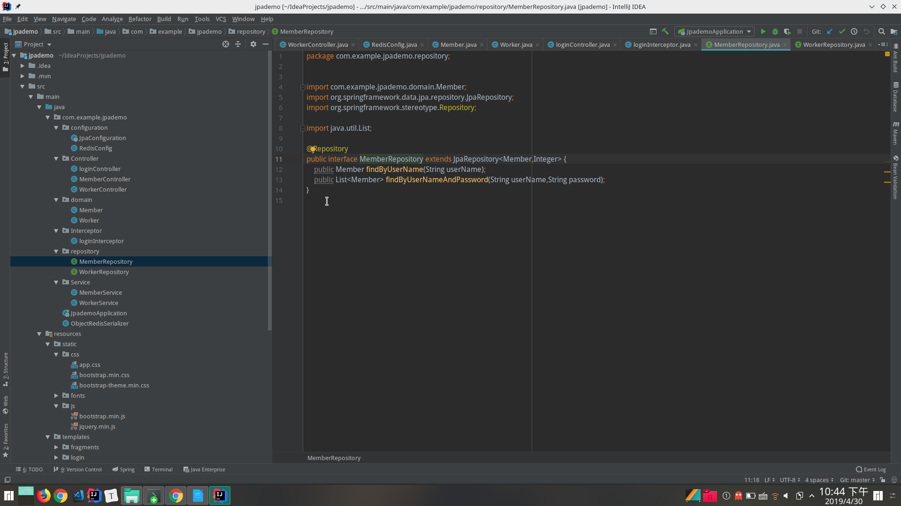

Worker

WorkerControler

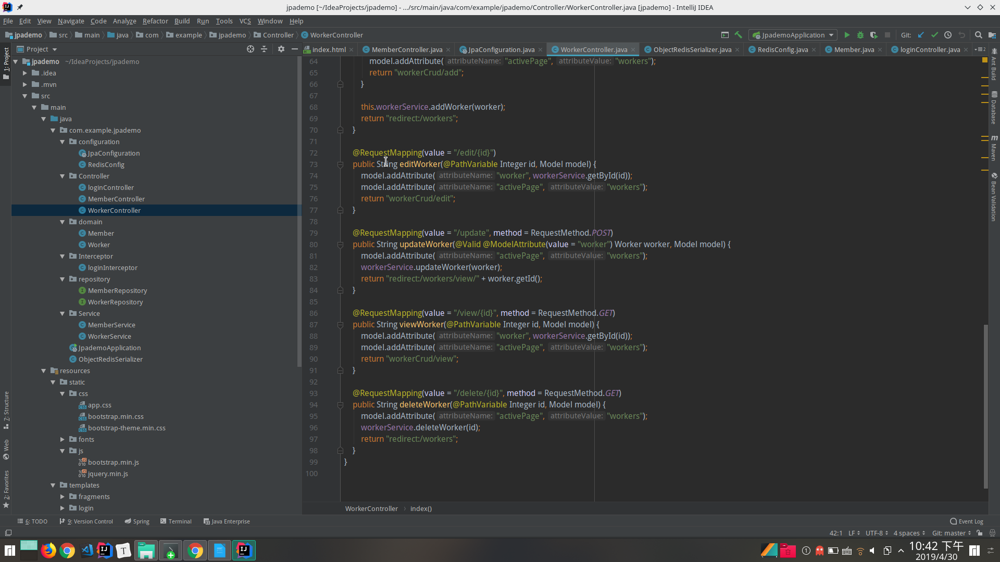

WorkerRepository

WorkerService

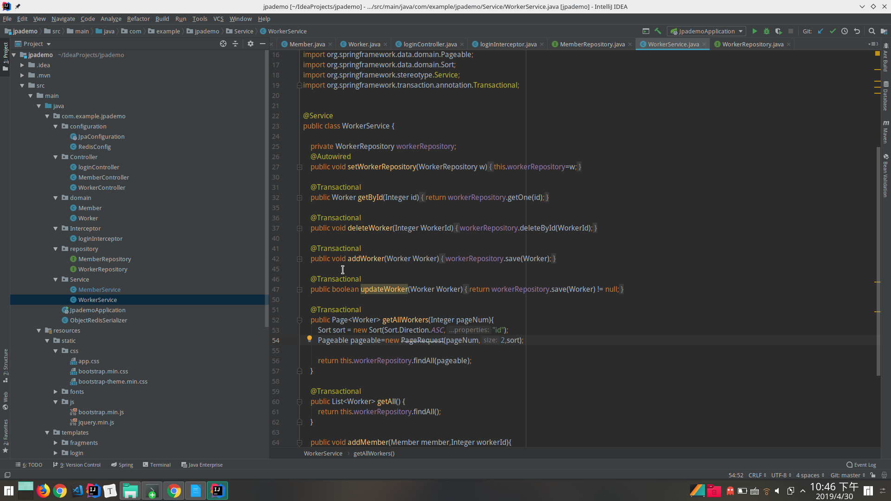

WorkerView

View

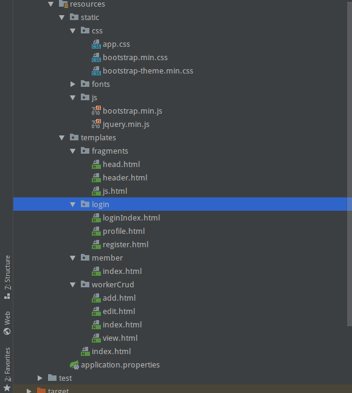